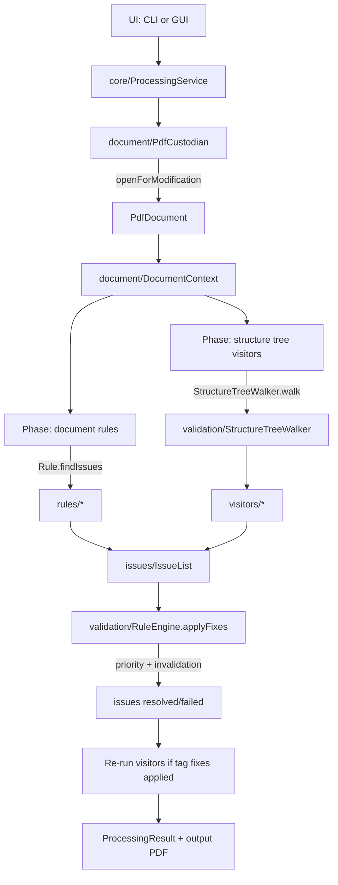

# Contributing to PDF-Auto-A11y

## Project Structure & Architecture

This project is organized around a small processing pipeline that:

1. Opens a PDF (read-only for analysis, read-write for remediation)
2. Builds a `DocumentContext` wrapper
3. Detects issues via document rules and structure-tree visitors
4. Optionally applies automatic fixes and re-validates

### Package Layout

Most code lives under `src/main/java/net/boyechko/pdf/autoa11y/`:

- `ui/`: CLI/GUI entry points and reporting (e.g. `PdfAutoA11yCLI`,
  `PdfAutoA11yGUI`, `ProcessingReporter`)
- `core/`: orchestration (e.g. `ProcessingService`, `ProcessingDefaults`)
- `document/`: PDF IO and context helpers (e.g. `PdfCustodian`,
  `DocumentContext`)
- `validation/`: validation engine and tree-walking infrastructure (e.g.
  `RuleEngine`, `StructureTreeWalker`, `TagSchema`)
- `rules/`: document-level checks that do not require a tree traversal
  (metadata, annotations, etc.)
- `visitors/`: structure-tree checks implemented as a single traversal of
  the tag tree (`StructureTreeVisitor`s)
- `issues/`: shared issue model (`Issue`, `IssueType`, `IssueList`,
  `IssueFix`, locations/severity)
- `fixes/`: automatic fix implementations (typically implement
  `IssueFix`)

Dependencies are meant to be directional: `ui/` depends on `core/`, and
`core/` orchestrates `validation/`, `rules/`, `visitors/`, `issues/`, and
`fixes/`.

### PDF Processing Flow

The main entry point for processing is `core/ProcessingService`.
`ProcessingService.analyze()` detects issues and reports them, while
`ProcessingService.remediate()` additionally applies available fixes and
returns a `ProcessingResult` that includes the (temporary) output file.



### How Issues Become Fixes

Detection produces `issues/Issue` instances. An `Issue` may optionally
carry an `issues/IssueFix` reference:

- Document-level rules implement `validation/Rule` and return issues from
  `Rule.findIssues(DocumentContext)`.
- Structure-tree checks implement `validation/StructureTreeVisitor` and
  return issues during the tree walk.
- Fix application is centralized in `validation/RuleEngine.applyFixes`.
  Fixes are sorted by `IssueFix.priority()` and can skip lower-priority
  fixes via `IssueFix.invalidates(...)`.

### Where to Add New Checks

- Tag-structure check: add a new `StructureTreeVisitor` in `visitors/`
  and register it in `core/ProcessingDefaults.visitorSuppliers()`.
- Document-level check: add a new `Rule` in `rules/` and register it in
  `core/ProcessingDefaults.rules()`.
- Automatic remediation: implement `IssueFix` (often in `fixes/`) and
  attach it when creating the corresponding `Issue`.

## Testing

### Running Tests

```bash
mvn test                                    # all tests
mvn test -Dtest=ProcessingServiceTest       # single class
mvn test -Dtest=ProcessingServiceTest#encryptedPdfRaisesException  # single method
```

### Test Output PDFs

Tests that create PDFs write them to `/tmp/pdf-autoa11y-test-pdfs/`,
organized by test class:

```
/tmp/pdf-autoa11y-test-pdfs/
  ProcessingServiceTest/
    brokenTagStructureIsDetectedAndFixed.pdf
    tagStructureIssuesCanBeFixed.pdf
    ...
  ConvertToArtifactTest/
    ...
```

Files are named after the test method that created them. They persist
between runs (until reboot) so you can inspect them manually. Override
the output directory with:

```bash
mvn test -Dpdf.autoa11y.testOutputDir=/path/to/dir
```

Static test input PDFs (e.g. `moby_dick.pdf`, `blank_password.pdf`)
live in `src/test/resources/`.

### PdfTestBase Framework

All PDF-related tests extend `PdfTestBase`, which provides:

#### Output Path Helpers

| Method | Returns | Purpose |
|---|---|---|
| `testOutputPath()` | `Path` | `{classDir}/{methodName}.pdf` |
| `testOutputPath(filename)` | `Path` | `{classDir}/{filename}` |
| `testOutputStream()` | `OutputStream` | Same as above, opened for writing |
| `testOutputStream(filename)` | `OutputStream` | Same as above, opened for writing |
| `testOutputDir()` | `Path` | `{baseDir}/{ClassName}/` |

The no-arg variants (`testOutputPath()`, `testOutputStream()`) derive
the filename from the current test method name automatically. Use the
explicit-filename variants when a test needs multiple files.

#### PDF Creation and Breakage

| Method | Returns | Purpose |
|---|---|---|
| `createTestPdf(content)` | `Path` | Create a tagged PDF at `testOutputPath()` |
| `createTestPdf(path, content)` | `Path` | Create a tagged PDF at a specific path |
| `breakTestPdf(content, breakage)` | `Path` | Create valid PDF, break it, return broken path |
| `saveRemediatedPdf(result)` | `void` | Copy remediated PDF to output dir |

`createTestPdf` accepts a `TestPdfContent` callback that receives
`(PdfDocument, Document)` -- use the layout API to add content:

```java
Path pdf = createTestPdf((pdfDoc, document) -> {
    document.add(new Paragraph("Hello"));
    document.add(new List().add(new ListItem("Item 1")));
});
```

`breakTestPdf` creates a valid PDF then corrupts its tag structure
using a `TagBreakage` strategy. It saves **two** files and returns
the broken one:

- `{method}_original.pdf` -- the valid version
- `{method}_broken.pdf` -- the broken version (returned)

Available breakages (`TagBreakage` enum):

| Breakage | What it does |
|---|---|
| `L_WITH_P_CHILDREN` | Moves P out of LI/LBody directly under L |
| `LI_WITH_SINGLE_P` | Strips Lbl/LBody from LI, leaving bare P |
| `MISSING_LBODY` | Removes LBody from LI, keeping only Lbl |

`saveRemediatedPdf` copies the remediated output as
`{method}_remediated.pdf`, completing the three-version set.

#### Structure Tree Helpers

| Method | Returns | Purpose |
|---|---|---|
| `findNthByRole(root, role, n)` | `PdfStructElem` | Find nth element with a given role |

### Test Patterns

**Simple analysis test** -- break a PDF, analyze it, check the issues:

```java
@Test
void tagStructureIssuesAreDetected() throws Exception {
    Path testPdf = breakTestPdf(
            MyTest::listContent, TagBreakage.L_WITH_P_CHILDREN);
    IssueList issues = createProcessingService(testPdf).analyze();
    assertFalse(issues.isEmpty(), "Should have at least one issue");
}
```

**Remediation test** -- break a PDF, remediate it, save all three
versions for manual comparison:

```java
@Test
void brokenTagStructureIsDetectedAndFixed() throws Exception {
    Path brokenPdf = breakTestPdf(
            MyTest::listContent, TagBreakage.L_WITH_P_CHILDREN);
    ProcessingResult result =
            createProcessingService(brokenPdf).remediate();
    saveRemediatedPdf(result);

    assertFalse(result.originalTagIssues().isEmpty());
    assertFalse(result.appliedTagFixes().isEmpty());
}
```

This produces three files for manual diff/inspection:
`brokenTagStructureIsDetectedAndFixed_original.pdf`,
`brokenTagStructureIsDetectedAndFixed_broken.pdf`, and
`brokenTagStructureIsDetectedAndFixed_remediated.pdf`.

**Revalidation test** -- verify a specific issue type is detected,
fixed, and does not reappear:

```java
@Test
void remediatedIssueIsNotReportedAsRemaining() throws Exception {
    Path inputPath = createPdfWithSpecificIssue();
    ProcessingResult result =
            createProcessingService(inputPath).remediate();
    saveRemediatedPdf(result);

    assertTrue(result.originalTagIssues().stream()
            .anyMatch(i -> i.type() == IssueType.SOME_ISSUE));
    assertTrue(result.appliedTagFixes().stream()
            .anyMatch(i -> i.type() == IssueType.SOME_ISSUE));
    assertTrue(result.remainingTagIssues().stream()
            .noneMatch(i -> i.type() == IssueType.SOME_ISSUE));
}
```

**Expected exception test** -- use `assertThrows`, not try/catch:

```java
@Test
void encryptedPdfRaisesException() {
    Path inputPath = Path.of("src/test/resources/blank_password.pdf");
    Exception e = assertThrows(Exception.class,
            () -> createProcessingService(inputPath).remediate());
    assertTrue(e.getMessage().contains("password"));
}
```

### Test Conventions

- **Let exceptions propagate.** Declare `throws Exception` on test
  methods instead of wrapping in try/catch. A test that swallows
  exceptions can never fail.
- **Don't clean up test PDFs.** The output directory is meant for
  manual inspection. `PdfTestBase` manages the directory structure.
  The one exception: intermediate temp files created as part of a
  multi-step PDF build pipeline (e.g. creating a valid PDF then
  breaking its tag structure) may be deleted by the helper method
  that creates them.
- **Name test methods descriptively.** The method name becomes the
  output filename, so `tagStructureIssuesCanBeFixed` produces
  `tagStructureIssuesCanBeFixed.pdf`.
- **Use `ProcessingResult` fields correctly.**
  `result.originalTagIssues()` is what was detected before
  remediation. `result.remainingTagIssues()` is what's left after.
  `result.hasTagIssues()` checks remaining, not original.
- **Use `assertFalse(list.isEmpty())` over `assertTrue(list.size() > 0)`**
  for clearer intent and better failure messages.
